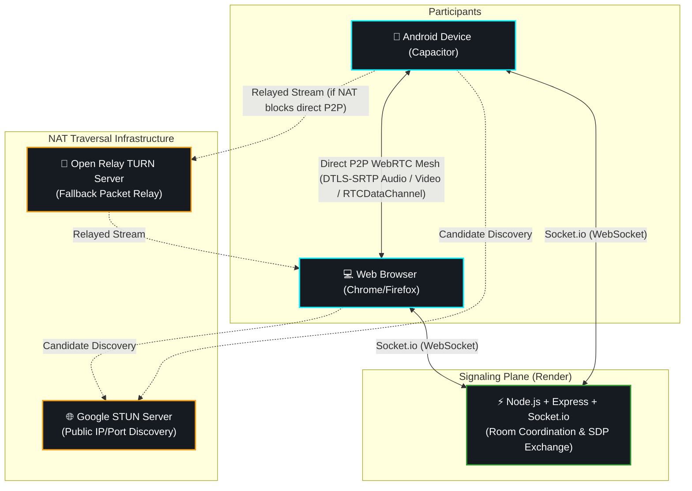
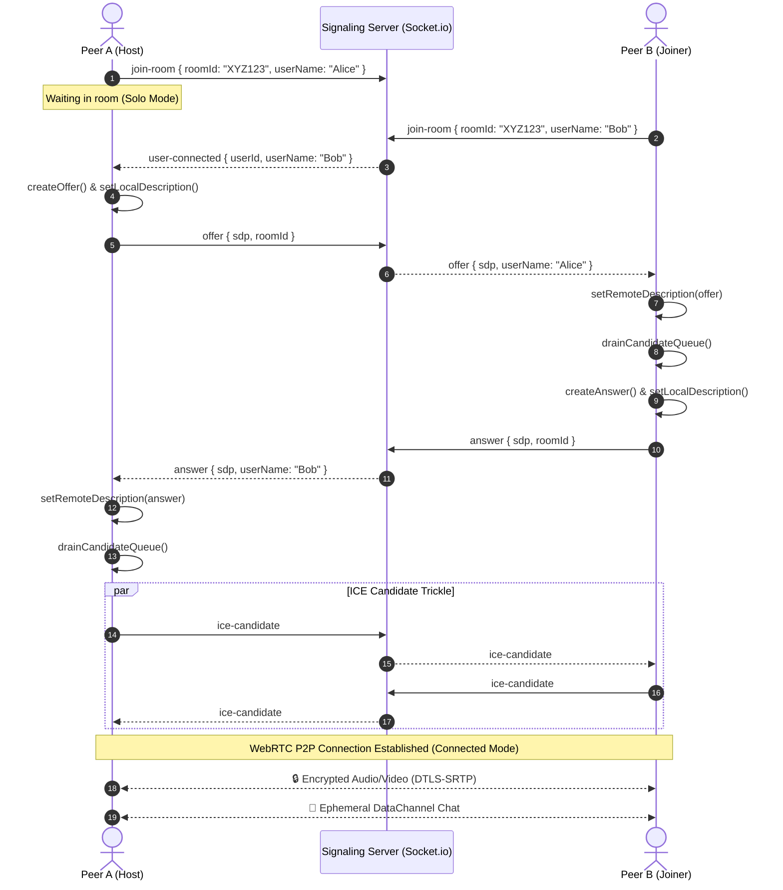

<div align="center">

# 
 FLUX

### Peer-to-peer encrypted video calling, wireless screen share, and ephemeral chat.

**Direct WebRTC mesh. Zero server media storage. Native Android & web interoperability.**

<br/>

[](https://webrtc.org/)
[](https://nodejs.org/)
[](https://socket.io/)
[](https://capacitorjs.com/)
[](https://developer.android.com/)
[](https://render.com/)

<br/>

[]()
[]()

<br/>

</div>

<br/>

<p align="center">
  <a href="https://flux-stream-zmdi.onrender.com"><strong>🌐 Live Web App</strong></a> •
  <a href="https://github.com/RASH-2137/Flux/releases"><strong>📱 Android APK Download</strong></a> •
  <a href="https://github.com/RASH-2137/Flux/issues"><strong>🐞 Report Bug</strong></a> •
  <a href="https://github.com/RASH-2137/Flux/issues"><strong>💡 Request Feature</strong></a>
</p>

> **Note:** The signaling backend is hosted on a free Render tier and may take a few seconds to respond during a cold start. Screenshots and architectural breakdowns are detailed below.

---

## 🚀 Live Access

Experience FLUX across web and mobile devices.

| Platform / Service | Access Link | Description |
|---|---|---|
| 🌐 **Live Web App** | [**vc.spacekid.xyz**](https://vc.spacekid.xyz) | Responsive client running in browser |
| 📱 **Native Android App** | [**GitHub Releases (APK)**](https://github.com/RASH-2137/Flux/releases) | Pre-compiled standalone Android APK |
| ⚡ **Signaling Server** | [**https://flux-stream-zmdi.onrender.com/**](https://flux-stream-zmdi.onrender.com/) | WebSocket/Socket.io signaling service |

---

## 📖 Overview

**FLUX** is an open-source, production-ready real-time communication platform engineered to deliver one-to-one encrypted video calls, desktop screen sharing, and ephemeral text chat with minimal infrastructure overhead.

Unlike traditional conferencing applications that route audio and video through bandwidth-intensive Selective Forwarding Units (SFUs) or centralized media servers, FLUX operates on a **pure peer-to-peer (P2P) mesh model**:

1. **Signaling Plane**: A lightweight **Node.js + Socket.io** service manages room coordination, SDP offer/answer exchanges, and ICE candidate negotiation. Once the peer connection is established, the signaling server completely steps aside.
2. **Media & Data Plane**: Direct **WebRTC** peer connections carry all high-definition video, audio, and text messages directly between participants. Traffic is protected in transit with **DTLS-SRTP encryption**.
3. **Cross-Platform Client**: Built with vanilla web standards and packaged for mobile using **Capacitor 8**, enabling cross-talk between mobile APKs and desktop web browsers without distinct codebases.

> [!TIP]
> FLUX stores zero user data, maintains no chat logs, and requires no registration. When a call terminates, all ephemeral session data residing in client RAM immediately clears.

---

## ⭐ Highlights

- ⚡ **Direct Peer-to-Peer Mesh**: Zero central media server bottlenecks; low latency video & audio streams.
- 🔒 **End-to-End Encrypted**: Media encrypted at the transport layer via standard DTLS-SRTP.
- 💬 **Ephemeral In-Memory Chat**: Text messages exchanged over WebRTC `RTCDataChannel` — never touching a database or server.
- 📱 **Unified Web & Android Architecture**: Single frontend codebase wrapped into a native Android APK via Capacitor.
- 🖥️ **Desktop Screen Sharing**: In-call presentation mode with track hot-swapping.
- 👤 **Smart Avatar Fallback**: Privacy toggle automatically transitions video feeds to initial-based avatar placeholders.
- 🌐 **Resilient NAT Traversal**: Google STUN + Open Relay TURN fallback for connectivity across restricted subnets and mobile carriers.
- 🛡️ **Race-Condition Safe**: FIFO candidate queue prevents asynchronous SDP/ICE packet dropouts.

---

## 📑 Table of Contents

- [Features](#-features)
- [Cross-Platform Experience](#-cross-platform-experience)
- [Product Showcase](#-product-showcase)
- [System Architecture](#️-system-architecture)
- [WebRTC Handshake Flow](#-webrtc-handshake-flow)
- [Engineering & Reliability](#-engineering--reliability)
- [Tech Stack](#️-tech-stack)
- [Repository Structure](#-repository-structure)
- [Getting Started](#-getting-started)
- [Building the Android APK](#-building-the-android-apk)
- [Deployment](#️-deployment)
- [Future Improvements](#-future-improvements)
- [Author](#-author)

---

## ✨ Features

<table>
<tr>
<td width="50%" valign="top">

### 📹 Encrypted Video Calling
Hardware-accelerated 1-on-1 audio and video calling with responsive layout adaptation: full-screen solo preview automatically transitions to an active picture-in-picture (PIP) view when the peer joins.

### 💬 Ephemeral DataChannel Chat
In-call messaging that operates purely in volatile memory. Messages travel directly through an encrypted WebRTC DataChannel without ever landing on server disks or databases.

### 👤 Privacy Avatar Mode
When a participant mutes their video, a lightweight DataChannel event updates the remote view, replacing the video feed with an initial-based placeholder while preserving audio continuity.

</td>
<td width="50%" valign="top">

### 🖥️ Desktop Screen Sharing
One-click screen sharing using the `getDisplayMedia` API. Live camera tracks are dynamically replaced on the active peer connection without tearing down the call.

### 🔄 Mobile Camera Switching
Seamless front-to-rear camera flipping on mobile devices using track replacement and device constraint queries.

### 🌐 Cross-Network Traversal
Configured with STUN and TURN relay fallbacks to guarantee connectivity across cellular networks, restrictive corporate firewalls, and emulator subnets.

</td>
</tr>
</table>

---

## 📱 Cross-Platform Experience

FLUX is designed to run seamlessly whether opened in a modern desktop browser or installed directly as a native Android APK.

### Desktop Web Experience
- Optimized layout supporting keyboard navigation (Enter to send chat).
- Fullscreen video layout with floating picture-in-picture stream.
- Native screen presentation support via desktop media capture APIs.

### Native Android Experience
- Packaged using **Capacitor 8** targeting modern Android runtime.
- Hardware permissions (`CAMERA`, `RECORD_AUDIO`, `MODIFY_AUDIO_SETTINGS`) pre-configured in `AndroidManifest.xml`.
- Screen share controls automatically adapt (hidden on mobile devices where display capture APIs are unavailable).
- Gesture-driven audio unlocker handling Android WebAudio autoplay restrictions.

---

## 📸 Product Showcase

### 1. Lobby & Room Creation
<div align="center">
  <!-- PASTE LOBBY SCREENSHOT HERE -->
   


</div>

<br/>

### 2. Active Encrypted Call (Desktop & Mobile PIP)
<div align="center">
  <!-- PASTE ACTIVE CALL SCREENSHOT HERE -->
   

     
</div>

<br/>

### 3. Ephemeral In-Call Chat Drawer 
<div align="center">
  <!-- PASTE CHAT & AVATAR SCREENSHOT HERE -->
   


</div>

<br/>

### 🎥 Live Demo Recording
<div align="center">
  <!-- PASTE SCREEN RECORDING / GIF HERE -->
  <video src="https://private-user-images.githubusercontent.com/178595938/665085368-c5d176bc-04cc-4210-a8bf-0ca8c5a97b3e.mp4?jwt=eyJ0eXAiOiJKV1QiLCJhbGciOiJIUzI1NiJ9.eyJpc3MiOiJnaXRodWIuY29tIiwiYXVkIjoicmF3LmdpdGh1YnVzZXJjb250ZW50LmNvbSIsImtleSI6ImtleTUiLCJleHAiOjE3OTExMDg3NTAsIm5iZiI6MTc5MTEwODQ1MCwicGF0aCI6Ii8xNzg1OTU5MzgvNjY1MDg1MzY4LWM1ZDE3NmJjLTA0Y2MtNDIxMC1hOGJmLTBjYThjNWE5N2IzZS5tcDQ_WC1BbXotQWxnb3JpdGhtPUFXUzQtSE1BQy1TSEEyNTYmWC1BbXotQ3JlZGVudGlhbD1BS0lBVkNPRFlMU0E1M1BRSzRaQSUyRjIwMjYxMDA0JTJGdXMtZWFzdC0xJTJGczMlMkZhd3M0X3JlcXVlc3QmWC1BbXotRGF0ZT0yMDI2MTAwNFQxMDA3MzBaJlgtQW16LUV4cGlyZXM9MzAwJlgtQW16LVNpZ25hdHVyZT1iNjk1NWVkNGQyMjk5OGU3ZDBjNzcwNjgwNjE1ZGRjMThmMGRiNWI4NjVhMDJhYjRiMTg4N2E5YTY5MmZiNTgwJlgtQW16LVNpZ25lZEhlYWRlcnM9aG9zdCZyZXNwb25zZS1jb250ZW50LXR5cGU9dmlkZW8lMkZtcDQifQ.AlpdxQxK27n0wbocFLcho5KFPevTVq-ABN6LE7jfy5Y" width="212" controls></video> |
</div>

---

## 🏗️ System Architecture

FLUX divides network communication into two discrete layers: **Signaling** (client-to-server) and **Media Mesh** (client-to-client).



---

## 🔄 WebRTC Handshake Flow

The sequence below illustrates how two clients establish an end-to-end encrypted session through the signaling server:



---

## 🛡️ Engineering & Reliability

WebRTC in real-world environments requires defensive engineering to withstand packet reordering, network changes, and browser policy restrictions. Below are key problems solved in FLUX:

### 1. ICE Candidate Race Condition & Queue Drain
* **The Problem**: WebRTC ICE candidates are generated asynchronously and can arrive at the remote peer over WebSocket before `setRemoteDescription()` has finished parsing the initial SDP offer/answer. Calling `addIceCandidate()` before `remoteDescription` is set throws an unrecoverable DOMException.
* **The Solution**: FLUX implements an in-memory FIFO queue (`candidateQueue[]`). Any incoming ICE candidate received while `remoteDescription` is null is placed into the queue. Once `setRemoteDescription()` resolves, `drainCandidateQueue()` safely processes and applies all queued network pathways.

### 2. Clean Peer Teardown & Reconnection
* **The Problem**: If a participant leaves and rejoins a room, lingering event listeners and stale `RTCPeerConnection` references can cause duplicate renegotiations or zombie states.
* **The Solution**: An explicit teardown pipeline (`closePeerConnection()`) detaches track senders, cleans up data channel listeners, closes the active connection instance, and resets the queue before initializing any new handshake.

### 3. Hybrid NAT Traversal (STUN + TURN Fallback)
* **The Problem**: While STUN successfully handles direct P2P connections under standard NAT routers, strict Symmetric NATs (common in corporate Wi-Fi, cellular carriers, and Android emulator virtual bridges) block direct peer binding.
* **The Solution**: Configured multi-tier ICE servers incorporating Google STUN (`stun.l.google.com:19302`) with an authenticated fallback to Open Relay TURN servers (`turn:openrelay.metered.ca`). Media remains end-to-end encrypted through the relay via DTLS-SRTP.

### 4. Mobile Audio Autoplay Unlocking
* **The Problem**: Modern mobile operating systems restrict incoming audio tracks from playing automatically until an explicit user interaction occurs on the DOM.
* **The Solution**: An event listener binds to `touchstart` and `click` events across the document, safely unmuting and calling `.play()` on incoming streams to ensure audio continuity.

### 5. Media Track Hot-Swapping
* **The Problem**: Toggling screen sharing or switching cameras should not disrupt the underlying WebRTC handshake or tear down the peer connection.
* **The Solution**: Utilizing `RTCRtpSender.replaceTrack()`, outgoing video tracks are hot-swapped at the encoder level without requiring SDP renegotiation.

---

## 🧰 Tech Stack

| Layer | Technology | Purpose |
|---|---|---|
| ⚡ **Signaling Server** | Node.js, Express, Socket.io | Manages room state and brokers initial SDP/ICE handshakes |
| 🔒 **Media & Transport** | WebRTC (RTCPeerConnection, RTCDataChannel) | Direct encrypted peer-to-peer audio, video, and data transmission |
| 🎨 **Frontend Client** | HTML5, CSS3, Vanilla ES6+ JavaScript | Zero-dependency, performant responsive user interface |
| 📱 **Mobile Runtime** | Capacitor 8 (Android) | Native web container declaring Android hardware permissions |
| 🌐 **NAT Traversal** | Google STUN + Open Relay TURN | Resolves public endpoints and relays traffic across restricted NATs |
| ☁️ **Cloud Deployment** | Render | Hosts the Node.js signaling and static client bundle with free SSL |

---

## 📂 Repository Structure

```text
Flux/
├── android/                         # Native Android Studio project (Capacitor)
│   ├── app/
│   │   ├── src/main/
│   │   │   ├── AndroidManifest.xml  # Hardware permissions (Camera, Mic, Audio)
│   │   │   └── java/com/flux/stream # Native Android activity wrapper
│   │   └── build.gradle             # Android build configuration
│   └── gradlew.bat                  # Gradle wrapper script
│
├── public/                          # Web frontend client bundle
│   ├── app.js                       # WebRTC engine, signaling handlers & UI logic
│   ├── index.html                   # Semantic HTML markup (Lobby, Video Grid, Chat)
│   ├── style.css                    # Glassmorphism dark-mode UI & responsive grid
│   └── socket.io.min.js             # Offline bundled Socket.io client
│
├── capacitor.config.json            # Capacitor bridge configuration
├── server.js                        # Express + Socket.io signaling server
├── package.json                     # Node.js project manifest & run scripts
├── .gitignore                       # Excludes build caches, node_modules & local SDK paths
└── README.md                        # Documentation
```

---

## 🚀 Getting Started

### Prerequisites

Ensure you have the following installed locally:
- **Node.js**: v18.x or higher
- **npm**: v9.x or higher
- **Android Studio** *(optional, required only for native APK compilation)*

### 1. Clone & Install Dependencies

```bash
git clone https://github.com/RASH-2137/Flux.git
cd Flux
npm install
```

### 2. Run the Signaling Server Locally

```bash
npm start
```

The server will start on port `3000`:
- **Local Browser:** `http://localhost:3000`
- **LAN Devices:** `http://<YOUR_LOCAL_IP>:3000` *(displayed in terminal output)*

### 3. Verify Two-Way Calling Locally
Open `http://localhost:3000` across two separate browser tabs:
1. Tab 1: Click **Create New Room** and copy the 6-digit code.
2. Tab 2: Paste the room code and click **Join Room**.
3. Both tabs will establish a local WebRTC loopback stream.

---

## 📱 Building the Android APK

FLUX compiles to a standalone Android APK using Capacitor and the Gradle toolchain:

### 1. Sync Web Assets to Android Project
```bash
npx cap sync android
```

### 2. Build the Debug APK
```bash
cd android
./gradlew assembleDebug       # Linux / macOS
.\gradlew.bat assembleDebug   # Windows PowerShell
```

The compiled binary will be generated at:
```
android/app/build/outputs/apk/debug/app-debug.apk
```

### 3. Install on Connected Device / Emulator
```bash
adb install -r android/app/build/outputs/apk/debug/app-debug.apk
```

---

## ☁️ Deployment

FLUX uses a unified deployment model where the signaling server and the static web client run together on a single Node service:

| Service | Host | Configuration |
|---|---|---|
| **Signaling & Web App** | [**Render**](https://render.com) | Node.js Web Service (`npm install` & `npm start`) |
| **Android APK** | [**GitHub Releases**](https://github.com/RASH-2137/Flux/releases) | Pre-compiled binary distributed via GitHub Tags |

### Environment Configuration
The client in `public/app.js` automatically resolves its signaling origin:
- If loaded over **HTTPS** (e.g. Render), it binds directly to `window.location.origin`.
- If running as an **installed APK**, it directs traffic to the configured production domain (`https://flux-stream-zmdi.onrender.com`).

---

## 🔮 Future Improvements

- [ ] 👥 Multi-peer mesh conferencing (mesh topologies for 3–4 participants)
- [ ] 📁 Peer-to-peer file transfer over RTCDataChannel
- [ ] 🎙️ Real-time audio waveform visualizer for active speaking indicators
- [ ] 🎛️ Configurable video quality / bitrate throttle for low-bandwidth connections
- [ ] 🔔 Push notification integration for room invitations

---

<div align="center">

**👨‍💻 Rahul Sharma**

Portfolio: [spacekid.xyz](https://spacekid.xyz) • GitHub: [@RASH-2137](https://github.com/RASH-2137)

[Report Bug](https://github.com/RASH-2137/Flux/issues) · [Request Feature](https://github.com/RASH-2137/Flux/issues)

</div>
